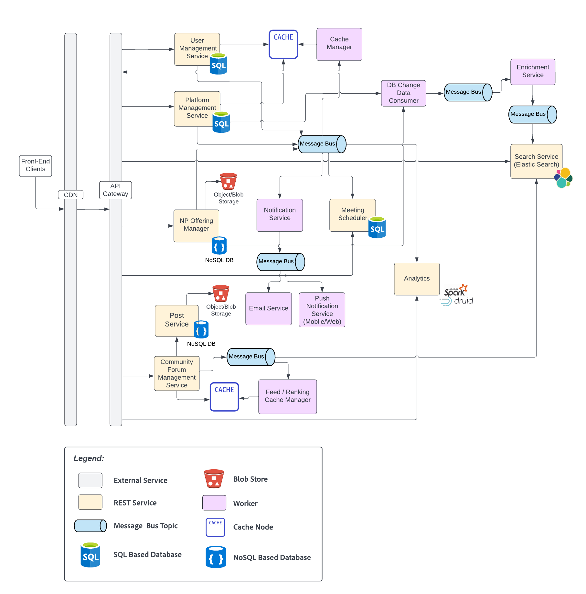

# The Spotlight App Project - Illuminate Possibilities

</img>

## Introduction
Diversity Cyber Council is a 501c3 Non-Profit that serves under-represented demographics in the tech industry by facilitating education, training, and staffing opportunities to establish a sustainable and diverse talent pipeline to the workforce. Their vision is to enhance inclusion and representation in the tech industry through training, mentoring, networking, and visibility programs. Their goal is to establish a sustainable and diverse talent pipeline that extends career equity to under-represented demographics by providing access to competent training programs that lead to direct employment opportunities. 

</img>

The Spotlight App Project is a sustained effort to amass a coalition of nonprofits in order to address specific needs within the communities, by leveraging a centralized platform as the base of operations to collaborate and make a collective impact. 

The project aims to solve two problems: 
1. The decentralization and lack of support between nonprofits create gaps of service and overall impact. 												
2. The lack of visibility of nonprofit groups and offerings creates a barrier of access to the people we aim to serve. 

This architecture document aims at providing a technology solution that serves the purpose of enhancing visibility, support, and collaboration of nonprofits serving similar needs in the community and operates as a candidate case management platform.

## Requirements
Please go through the provided [requirement document](https://docs.google.com/document/d/1XjEpcGJ87xYg1eWN9eE0_tH7te5HcVAgPvoONLHY4qQ/edit) to understand the requirements better. These requirements were the main drivers for the design decisions in our architectural proposal.
- [Functional Requirements](./requirements/functional-requirements.md): Here you'll find the different actors in the system, functionalities each user can do (aka user stories), assumptions and constraints that we considered during the process.
- [Architecture Characteristics](./requirements/architecture-characteristics.md): The architecture design must incorporate these characteristics along with the above mentioned functional requirements.

## Context View
</img>

## Architecture Highlights
The following points outline how does the architecture support some of the hard-requirements of this platform:

### Ease of Use
To facilitate ease-of-use, the Spotlight App -
- Supports multiple user surfaces - Web and Mobile. This enables users to access the platform on-the-go as per their preference.
- Creates device-size specific renditions of images present in the assignments, profiles and community posts. Based on the user-device, appropriate image rendition is returned for a seamless experience.
- Ensures that all entities in the system (candidates, non profits, services, communities, posts etc.) are searchable. It intelligently tags for seamless discovery and retrieval.
- User Experience (UX) plays a critical role in ensuring ease-of-use of the Spotlight App. The UX ensures seamless onboarding experience, continuous progress tracking, constant feedback and access to community forums.

### Engagement
To facilitate engagement, the Spotlight App -
- Rewards the candidates and non-profits with points and badges
- Highlights the top non-profits, top candidates, top communities, top community posts in the app. These top entities are computed platform wide and globally over a period of time (weekly, monthly etc).
- Supports notifications on all possible user surfaces - Web and Mobile. This helps in keeping the users connected and engaged.
- Ensures that the community leader and career mentor play a critical role in the engagement.
- Provides community forums where candidates, non-profits and community leaders can collaborate, share announcements/posts and ask questions.

### Analytics / Reporting
To facilitate analytical reporting, the Spotlight App -
- Provides powerful visualisation tools to analyse data to gain meaningful insights.
- Supports SQL based dashboards to create reports and visualisations for custom queries.
- Is powered by machine learning to perform predictive analysis, data classification etc. to plan for future requirements, gaps in the services and so on.

## Architecture
Below is a high-level view of the system that fulfills all the requirements (see [below section](#component-architecture-views) describing the components in detail):

### Component Architecture Views
The main part of the design proposal is the set of architecture views seen below:
- [User Onboarding and Management](./architectural-views/user-onboarding-management.md)
- [Notification and Meeting Scheduler Service](./architectural-views/notification-and-meeting-service.md)
- [Community Forum Management Architecture](./architectural-views/community-forum-management.md)
- [Search and Enrichment Service Architecture](./architectural-views/search-and-enrichment-service.md)
- [Database Change Data Consumer Microservice](./architectural-views/database-change-data-consumer.md)
- [Operational Reporting](./architectural-views/operational-reports.md)
- [Analytical Architecture](./architectural-views/analytical-architecture.md)

### Deployment View
Below is a physical/deployment view for the components seen in the above architectural views:

| [AWS deployment view](./architectural-views/physical-view-aws-deployment.md) |
|---|
|  |

### Observability
Observability plays an indispensible role in providing the tools to effectively monitor the usage, performance and health of the system. Spotlight App makes good use of all three pillars involved in Observability - Metrics & Monitoring, Logging and Distributed Tracing. For more details, see [Observability: Metrics & Monitoring, Logging and Distributed Tracing](./architectural-views/observability.md).

## ADRs
Below are the key architectural decision records:
- [Microservice vs Monolith Style of Architecture](adrs/adr01-microservice-architecture.md)
- [Event driven architecture (EDA)](adrs/adr02-eda-architecture.md)
- [Database Considerations: MySQL vs NoSQL](adrs/adr03-sql-vs-nosql.md)
- [Change Data Capture (CDC)](adrs/adr04-change-data-capture.md)
- [AWS for deployments](adrs/adr05-AWS_for_deployment.md)
- [Caching using Cache Manager](adrs/adr06-caching.md)
- [ElasticSearch as the Search Provider](adrs/adr07-elastic-search_for_search.md)

---

## Directory Structure
- [ADRs](./adrs/) - contains all architecture decisions.
- [Architectural Views](./architectural-views/) - contains detailed architectural views with supporting documentation for every component.
- [Architecture Evaluation](./evaluation/) - contains evaluation of the proposed architecture - cost analysis and validation that all architectural characteristics and requirements are fulfilled.
- [Images](./images) - contains architecture diagrams and other supporting images. 
- [Requirements](./requirements/) - contains the requirements and architecture characteristics considered.

## Tools Used
- [Lucid Chart](https://lucid.app/) - We used Lucid Chart for creating all of our architecture diagrams.
