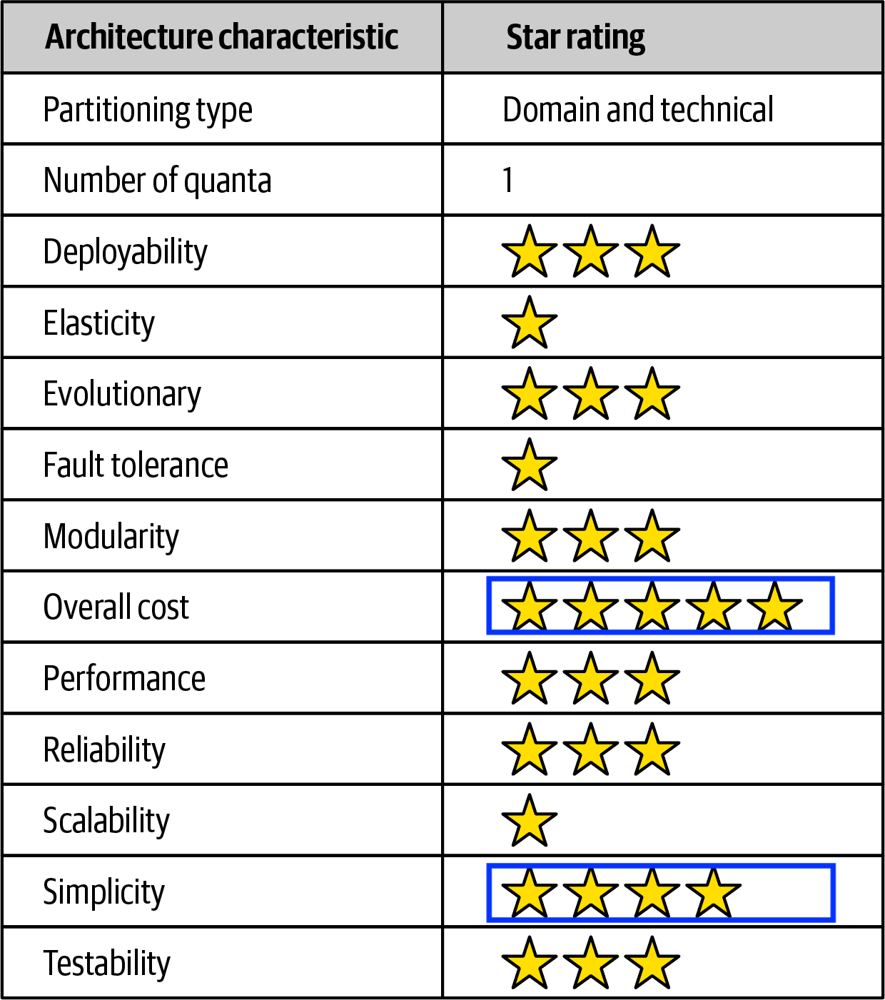
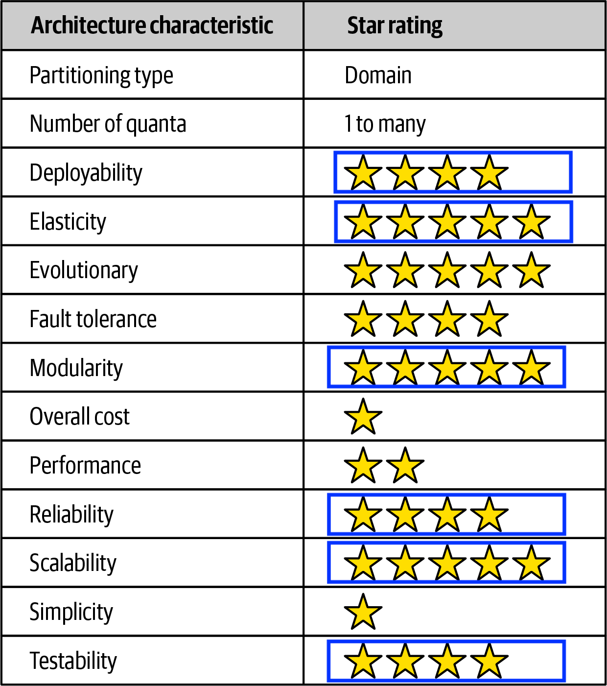
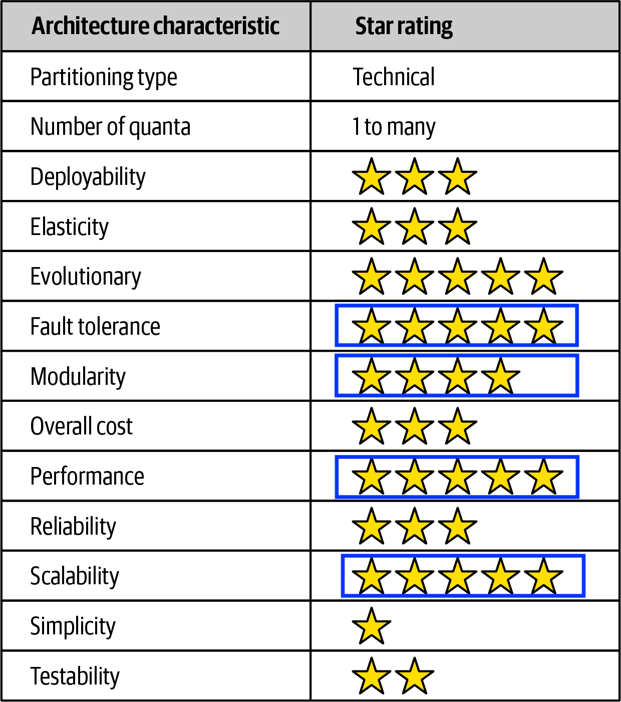

# Microservices Architecture v/s Monolithic Architecture

## Status
Approved

## Context
The Spotlight App Project is an app that connects non profit organisations on a collaborative platform to make their offerings related to career building, discoverable to candidates of diverse under represented groups.
The users of the app include non-profits, candidates, admins, career mentors, community leaders.
The functionality provided by the platform is diverse and needs to cater to all the users requirements in addition to creating operational and analytical reports.

## Decision 
A microservices architecture would better suit the needs of this application

## Rationale

We have identified the key [architectural characteristics](../requirements/architecture-characteristics.md) based on the requirements. Let us now compare the various architectural styles based on these characteristics.

While we compared the various architectural styles, we will be comparing the ones we felt were closest to our requirements: 
- Microkernel architecture ( Monolith )
- Microservices architecture ( Distributed )
- Event Driven architecture ( Distributed )

#### Microkernel architecture
</img>

On analysing the above architectures, we see that while the microkernel architecture does very well in terms of cost and simplicity, it lacks in key areas such as scalability, performance and modularity. 

#### Microservices architecture 
</img>

The microservices architecture on the other hand excels in scalability, modularity, elasticity, testability ( which helps make the system more maintainable and reliable ).
However in case of microservices, cost is of concern. 

#### Event Driven Architecture
</img>

Event driven architecture has high performance, highly scalable, facilitates loose coupling between the various services which helps make the system modular and fault tolerant.

Spotlight app needs to be scalable to millions of users. The performance of the system determines engagement with the application by the users. 
The system should also be able to evolve based on the customer needs. The infrastructure needs to be maintainable and scalable.

For this reason, we selected a hybrid architecture that combines microservices and [event driven architecture](./adr02-eda-architecture.md). 

Each service can be scaled individually based on requirements. New microservices can be easily added.
Subsystems can be easily replaced with alternate solutions without affecting the rest of the system.
Each service can be developed and deployed independently enabling agile development frameworks, and minimal downtimes. 

## Consequences
Cost is of concern in a microservices architecture. We have done extensive [cost analysis](../evaluation/cost-analysis.md) for this reason. 
We have also elaborated on ways one can achieve [cost-savings](../evaluation/cost-analysis.md#note-on-cost-savings), there by making it more feasible to build a 
highly scalable, performant and fault tolerant distributed system that fits the requirements of Spotlight App.

Debugging and monitoring can be an issue in a microservices architecture. 
Using metrics collection, logs for every service and distributed tracing can help resolve this issue. Read more on [Observability](../architectural-views/observability.md).

## Reference 
Book: Fundamentals of Software Architecture
Authors: Mark Richards, Neal Ford
