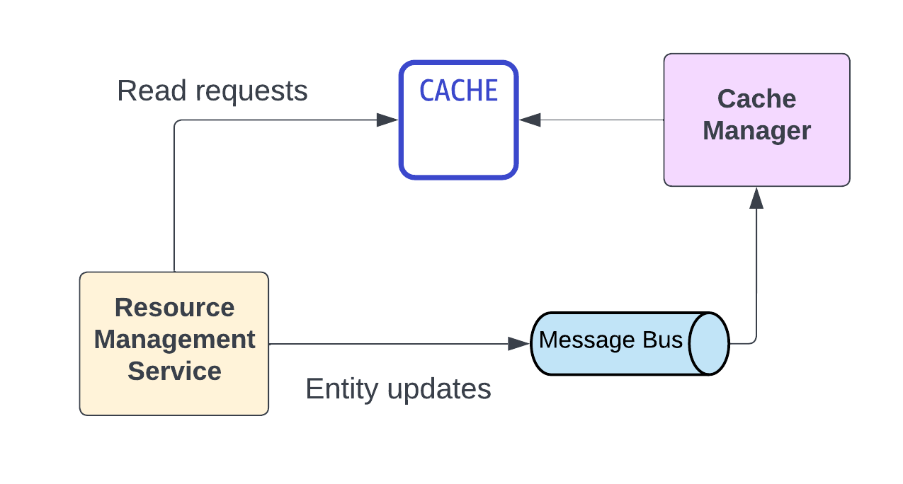

# Caching

## Status
Proposed

## Context
Ease of use of the Spotlight app is one of the primal requirement for its success. Page load time is an important criteria that determines the quality of the end user experience. To this avail, Spotlight app utilizes caching for almost all its entities.

Caching is a common architectural paradigm that not only helps reduce the page-load time, but also help in retrieving data efficiently without loading the critical infrastructure in the system.

'Cache Manager' micro-service consumes all entity updates via the message bus and updates the in-memory cache. This provides an efficient way to manage cache entities, populate cache on demand.

</img>

### Caching strategies that were evaluated 

#### Write through cache

- The data is first written in the cache and then it is written to the database. This way you can keep the consistency of your data between your database and your cache. Every read done on the Cache follows the most recent write. We can use this approach for the applications which have frequent re-read data once it’s persisted in the database.

##### Why was this rejected?

- This approach involves a non-atomic way of sequentially updating cache and database. Special handling is required for cases where the first step (writing to cache) succeeds, but the second step (writing to database) fails. This makes the development complex and couples the business logic with cache-management.

#### Write around cache

- Similar to the write-through you write to the database but in this case you don’t update the cache. So data is written directly to the storage, bypassing the cache. You don’t need to load the cache with data that wouldn’t be re-read. This approach reduces the flooded write operation compared to the write-through cache.

##### Why was this rejected?

- When an entity is updated, this approach requires explicit cache invalidation to ensure that the read request returns the most recent version of the entity. Again, because of such special handlings, this makes the development complex and couples the business logic with cache-management.

## Decision

- Use 'Cache Manager' micro-service that consumes all entity updates via the message bus, and updates the in-memory cache.
- Use Redis based in-memory cache managed offering.  

## Rationale
- This approach uncouples the core business logic from cache-management, provides an robust way to manage cached entities and offers flexibility in the caching logic.

## Consequences
- This approach requires an additional micro-service 'Cache Manager'. 
- Since cache updates use an event-driven design and are handled by a separate microservice 'Cache Manager', the changes propogated to the cache are eventually consistent.

Given that caching is a central and important part of the system, this added complexity in the architecture is worth the effort as it provides a seamless caching approach and helps in fulfilling the ease-of-use requirement.

### References
- [Caching – System Design Concepts](https://www.geeksforgeeks.org/caching-system-design-concept-for-beginners/)