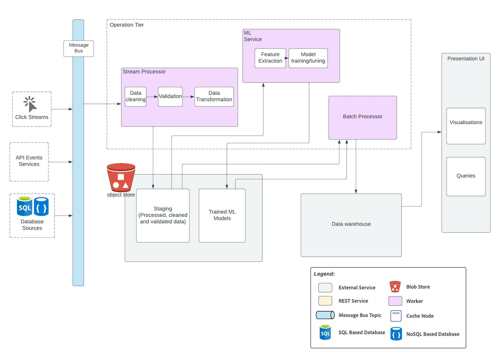

# Analytics Subsystem
Analytics Subsystem is responsible for analytical reporting such as projections of future desirable career paths, offering gaps in a region based on demand, and so on. 

See platform requirements [#4, #5, #9](../requirements/functional-requirements.md#functional-requirements), non-profit requirement [#NP6](../requirements/functional-requirements.md#user-stories), candidate requirement [#C6](../requirements/functional-requirements.md#candidate), community leader requirement [#CL6](../requirements/functional-requirements.md#community-leader), career mentor requirement [#CM3](../requirements/functional-requirements.md#career-mentor) and admin requirement [#A4](../requirements/functional-requirements.md#admin).

|  |
| --- |
| _Created using Lucidchart. Refer [here](https://lucid.app/documents/view/89c19b66-2890-425f-b6f1-1ebba1845036)._ |

## Element Catalog 
- Data Ingestion
- Data Lake
- Operational Tier
- Data warehouse
- Presentation Tier

#### Data Ingestion
This includes data from various sources such as click streams, feedback forms, databases, events emitted from various 
services. All the data is made avaiable on various topics in a message bus like Kafka which are then further processed by the Operational Tier. 

#### Data Lake
Data Lakes can be used to store pre-processed data that are cleaned, validated and transformed into the desired format. 
This data is called staging data which is then further used to train or tune Machine Learning and for reporting. 
The machine learning models are also stored in the Data Lake.

Some examples of technologies that can be used for data lake include:
- AWS S3
- HDFS

#### Operational Tier
The operational tier consists of services that do stream processing or batch processing on the data coming from the message bus or message stored in the data lake.

Stream processing on incoming data stream could include cleaning, validating and transforming the data into meaningful formats.

There is a machine learning service that can be used to train, tune machine learning models that will help to perform analytical tasks such as 
predictive analysis (eg. projections of future desirable career paths), data classification , regression models for trend analysis, etc. Machine learning models 
can also be trained that would help in the operational architecture such as for automatic tagging various NPO offerings based on their services and offerings, 
recommendation service to help automatically match the candidates needs to the available offerings with a higher level of confidence in the suggestions provided.

Some technologies that can be used to train ML models include:
- [Apache Spark MLib](https://spark.apache.org/mllib/)
- [Amazon Sagemaker](https://aws.amazon.com/sagemaker/)

Then we have micro batch processing service that fetches the data from the staging area in the data lake, 
processes the data using the ML models , and creates various views of the data depending on the type of reports that need to be generated. 

All the data are then stored in a data warehouse. 

#### Data Warehouse

Data warehouses store the final curated data on which various types of views can be obtained for analysis.
Data from the data warehouse can be easily analysed using various Business Intelligence (BI) tools, and by searching using SQL queries. 

Some examples of technologies that can be used for datawarehouse include:
- [Apache Druid](https://druid.apache.org/)
- [Amazon Redshift](https://aws.amazon.com/redshift/)

#### Presentation Tier
Presentation Tier includes various tools for visualising the data in the data warehouse. It can either be reports created using SQL queries which is supported by many data warehouses or 
using powerful visualisation software that provide easy to use and intuitive tools to create simple to very detailed geospactial visualisations of the data.

For instance, for visualisation one can use [Apache Superset](https://superset.apache.org/)
Superset is highly scalable and easily integrates with warehouses like Apache Druid, Amazon Redshift and also with MySQL to help derive detailed analytical insights.

## Outcome
All these tools help in creating great reports, and retrieve valuable information from data, that can help make business decisions to increase adoption 
and engagement in the spotlight app.
 
