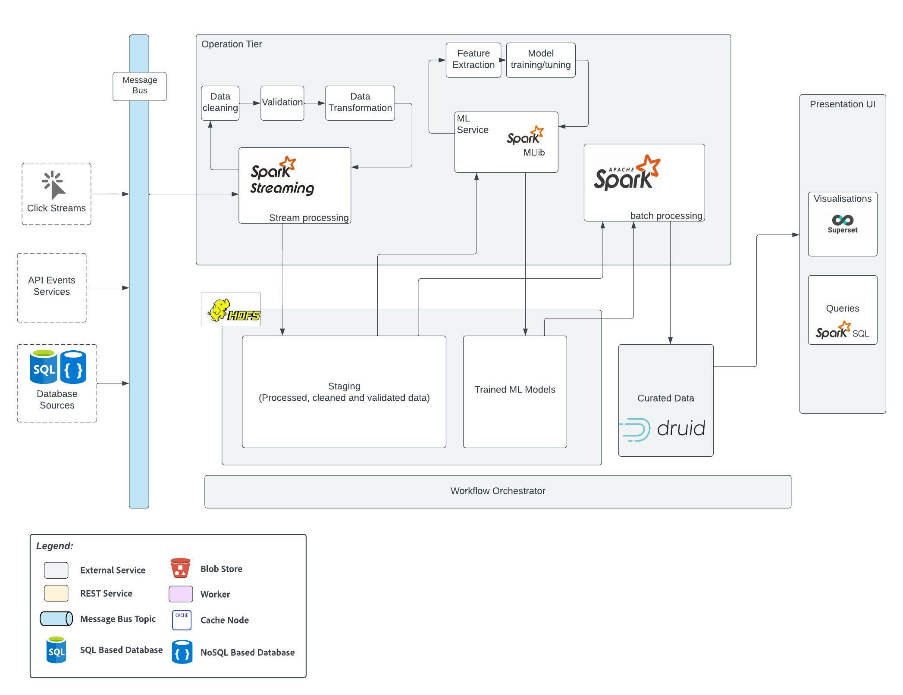

# Analytical Architecture
Analytical Architecture for analytical reporting such as projections of future desirable career paths, Offering gaps in a region based on demand, and so on. 

See platform requirements [#4, #5, #9](../requirements/functional-requirements.md#functional-requirements), non-profit requirement [#NP6](../requirements/functional-requirements.md#user-stories), candidate requirement [#C6](../requirements/functional-requirements.md#candidate), community leader requirement [#CL6](../requirements/functional-requirements.md#community-leader), career mentor requirement [#CM3](../requirements/functional-requirements.md#career-mentor) and admin requirement [#A4](../requirements/functional-requirements.md#admin).

_Created using Lucidchart. Refer [here](https://lucid.app/documents/view/89c19b66-2890-425f-b6f1-1ebba1845036)._

## Element Catalog 
- Data Ingestion
- Data Lake
- Operational Tier
- Data warehouse
- Presentation Tier
- Operation Scheduler

#### Data Ingestion
This includes data from various sources such as click streams, feedback forms, databases, events emitted from various 
services. All the data is made avaiable on various topics in Kafka which are then further processed by the Operational Tier. 

#### Data Lake
Data Lakes such as HDFS cna be used to pre-processed data that are cleaned, validated and transformed into the desired format. 
This data is called staging data which is then further used to train or tune Machine Learning and for reporting. 
The machine learning models are also stored in the Data Lake.

#### Operational Tier
The operational tier consists of service that uses Apache Spark Streaming to pre-process stream data from various Kafka topics.

There is a machine learning service that uses Apache Spark MLib library to train, tune machine learning models that will help to perform analytical tasks such as 
predictive analysis (eg. projections of future desirable career paths), data classification , regression models for trend analysis, etc. Machine learning models 
can also be trained that would help in the operational architecture such as for automatic tagging various NPO offerings based on their services and offerings, 
recommendation service to help automatically match the candidates needs to the available offerings with a higher level of confidence in the suggestions provided.

Then we have micro batch processing service using Apache Spark that fetches the data from the staging area in the data lake, 
processes the data using the ML models , and creates various views of the data depending on the type of reports that need to be generated. 

All the data are then stored in a datawarehouse. 

#### Data Warehouse

For datawarehouse, the proposed technology is Apache Druid, an open source distributed data store that provides the capabilities of 
time series databases, data warehouses and search systems to create a real time high performance real-time analytics database.
It is a highly performant database that can ingest millions of events/sec, retain years of data, and provide sub-second queries. 

Data can be easily analyses using various BI tools that easily integrate with Druid, and also by searching using SQL queries. 
More details on Apache Druid and its capabilities can be found here: https://druid.apache.org/technology

#### Presentation Tier
Presentation Tier includes various tools for visualising the data in the data warehouse. It can either be reports created using Apache Spark SQL 
or using Apache Superset that provides easy to use and intuitive tools to create simple to very detailed geospactial visualisations of the data.
Superset is highly scalable and easily integrates with Apache Druid to help derive detailed analytical insights.

For more details on Superset: https://superset.apache.org/

#### Operation scheduler
Operation scheduler helps in orchestrating the services in the operational tier, scheduling jobs at regular intervals, 
determining the order in which the jobs are executed and so on.

## Outcome
All these tools help in creating great reports, and retrieve valuable information from data, that can help make business decisions to increase adoption 
and engagement in the spotlight app.
 
