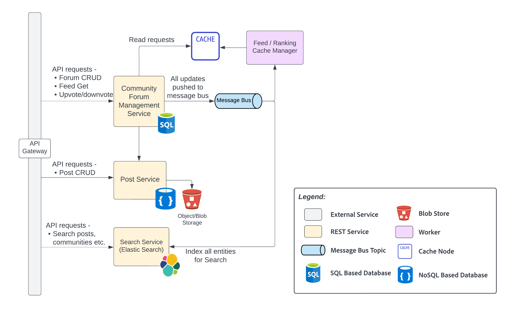

# Community Forum Management
Community Forums are the heart of the Spotlight ecosystem that bring together all the involved users.  

</img>

## Element Catalog 

#### Commmunity Forum Management Service

- Community Forum Management Service (CFMS) manages communities, community-memberships, forums, posts, post-votes, and user-rewards. It uses a SQL database to manage these entities and their relationships.

- CFMS and related services use event-driven architecture to support high scale and resiliency. It enables asynchronous processing of high volume workflows thereby uncoupling the services to process high volume non-urgent workflows asynchronously.

- CFMS publishes common interaction events (post CRUD, upvotes, user memberships to community etc.) into the Message Queue. 

- These events are consumed by "Feed / Ranking Cache Manager" to populate user-feeds into the Cache for faster retrieval.

- These events are also consumed by Search Service for faster discovery and retrieval of communities, posts etc. 

#### Post Service
- Post Service is responsible for create/read/update/delete user posts, upload assets to Object Store. It use a NoSQL key-value database that offers a scalable store for Posts. 

#### Feed / Ranking Cache Manager
- Feed / Ranking Cache Manager is responsible for intelligently computing the top-posts (based on upvotes, downvotes, views etc), managing the top ranking of posts in a feed (per community, per region etc.) and offers a way to retrieve most meaningful top posts per user.
- Redis Cache offers sorted data-structures that can help maintain entity ids in a ranked/sorted fashion. 

#### Search Service
- Search Service makes the common entities in a community (candidates, non profits, services, communities, posts etc.) searchable. It intelligently tags these entities for seamless discovery and retrieval.
- Search Service uses ElasticSearch for maintaining the search index.

 
## Related ADRs 

