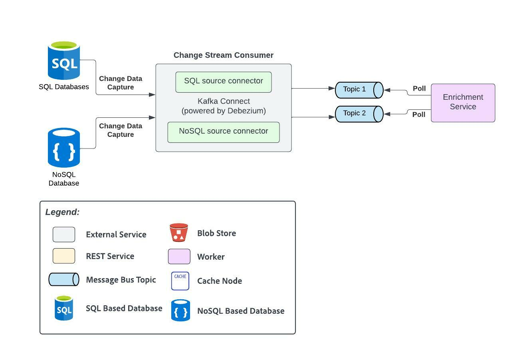

# Database Change Data Consumer Microservice
The change data capture ([CDC](https://en.wikipedia.org/wiki/Change_data_capture)) pattern is a set of software design patterns used to determine and track the data that has changed so that action can be taken using the changed data.
This service is specifically responsible for reading those change streams from respective databases and send them for processing accordingly.
For SQL type of databases, say MySQL for example, binary log replication can be used to track changes for CDC.
For NoSQL type of databases, say MongoDB for example, [change streams](https://www.mongodb.com/docs/manual/changeStreams/) can be leveraged for CDC.

</img>
_Created using Lucidchart. Refer [here](https://lucid.app/documents/view/b139e1e3-a37a-403b-9390-d198c7e7ab27)._

## Element Catalog 

#### Change stream consumer
- CDC consumer will abort retries for fatal errors and implement exponential back-off during error scenarios. This will ensure resiliency and avoid excess pressure on the database.
- Each CDC consumer that processes changes will send the data (one message per change) to a queue. This will ensure that we are able to process database changes at a consistent rate that are not affected by outages to the rest of the stack.
- Shall leverage [Kafka Connect](https://docs.confluent.io/platform/current/connect/index.html) powered by [Debezium](https://debezium.io/) for ingesting change streams from different databases. Debezium is an open source distributed platform for change data capture whereas Kafka Connect is a free, open-source component of Apache Kafka that works as a centralized data hub for simple data integration between databases.

## Related Views
- [Search Subsystem(./search-subsystem.md)

## Related ADRs 
- [Change Data Capture](../adrs/adr04-change-data-capture.md)
