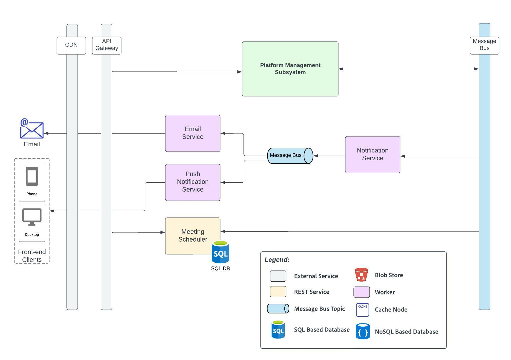

# Notification and Meeting Scheduler Subsystem

This subsystem comprises of the following major components:
- **Notification Service**: Handles push based (mobile & web) and email based notifications.
- **Meeting Scheduler**: Manages community meetings, meetings between community leader and non-profits, career mentors and candidates and other ad-hoc meetings for increasing collaboration.

See platform requirement [#1](../requirements/functional-requirements.md#functional-requirements), community leader requirement [#CL2](../requirements/functional-requirements.md#community-leader) and career mentor requirement [#CM5](../requirements/functional-requirements.md#career-mentor).

_Created using Lucidchart. Refer [here](https://lucid.app/documents/view/b52fc8b9-1ada-4c67-9c6f-0a882811384d)._

## Element Catalog 

#### Notification Service
Notification micro-service is responsible for sending email and push notifications (mobile/web) to candidates, non-profits, community-leads and career-mentors to update them about their progress, notify them when something needs their attention and keep them engaged with the platform.

Notification Service leverages Email Service and Push Notification Service. We have created separate micro-services for Email and Push notifications as they have different scalability requirements, may be configured with different scaling policies. Having separate micro-services maintain separation-of-concern and the functionality can be selectively outsourced to a third-party service.

Notification service works as follows -

- Consume messages from the Message Queue
- Determine the kind of notifications required for each message-type (email or push)
- Fetch the list of recipients (different actions can have different recipients)
- Use Email Service or Push Notification Service for notifications.

#### Email Service

Email Service is responsible for sending emails to the recipients. This can be a self-managed SMTP server or a third-party email service provider.

#### Push notification service (mobile/web)

Push Notification service, as its name suggests, is responsible for sending push notifications to the recipient’s mobile device or web browser.
Push notification keeps track of deviceIds that are required for pushing notifications. This information can be stored in a simple key-value store.

#### Meeting Scheduler
Meeting Schedule is responsible for scheduling and managing meetings between non-profits and candidates. It also provides APIs to return meetings/calendar for a given candidate, non-profit, community-leader or career mentor.

Meeting scheduler works as follows -

- Consume messages from the Message Queue
- Determines the meetings required for each message-type. For example, when a community leader is assigned to a non-profit during its onboarding, this service schedules the initial onboarding meeting within 1-2 weeks, schedules a regular meeting at a pre-configured cadence etc.

For tracking the scheduled meetings, Meeting Scheduler service uses a SQL database. For scheduling meetings, this service can optionally leverage third-party services like Google Meet or Zoom to facilitate virtual meetings.

## Out-of-the-box (OOTB) Offerings Considerations
[Google Calendar](https://developers.google.com/calendar/api/guides/create-events) can be leveraged for scheduling events. It can be easily integrated with [Google Meet](https://developers.google.com/calendar/api/guides/create-events#conferencing) for virtual meetings.
  
## Related ADRs
- [Microservices Architecture](../adrs/adr01-microservice-architecture.md)
- [Event Driven Architecture](../adrs/adr02-eda-architecture.md)
