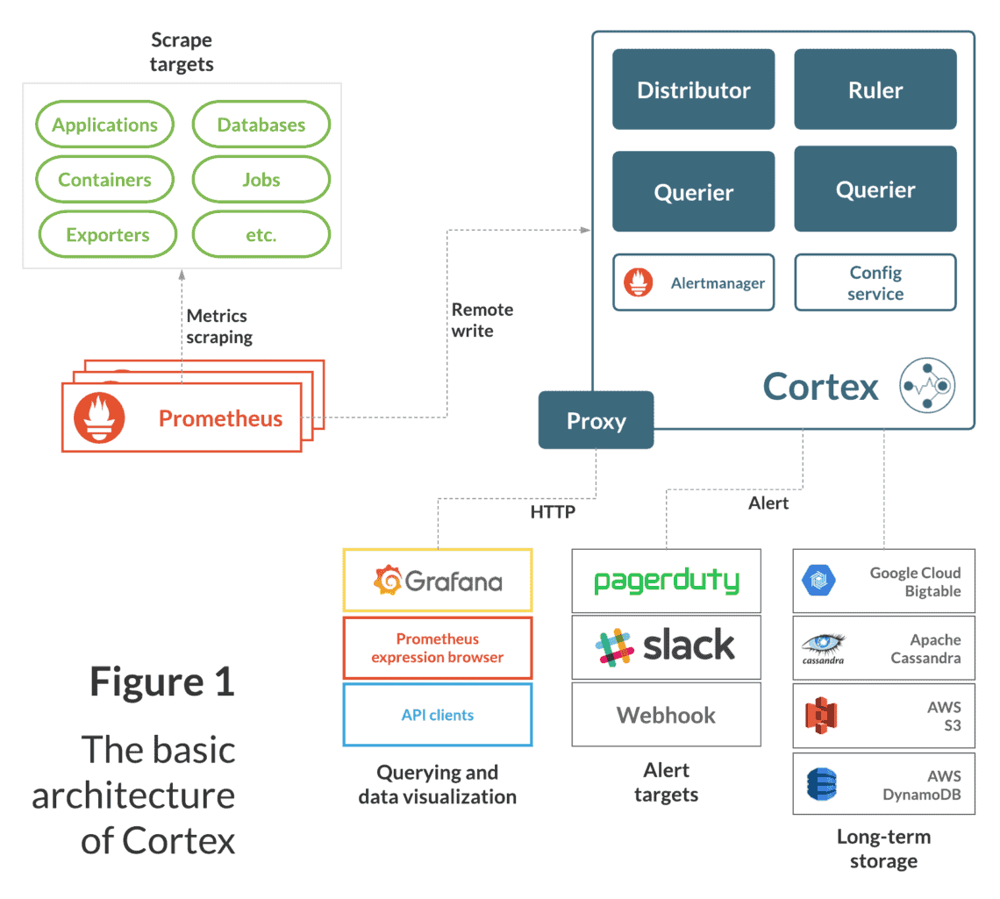

# Observability: Metrics & Monitoring, Logging and Distributed Tracing
Observability plays an indispensible role in providing the tools to effectively monitor the usage, performance and health of the system. It helps in maintaining the resiliency and robustness of the system by keeping it healthy and minimizing the mean time to detect and resolve an issue (MTTR).

On a high level, Observability comprises of three pillars: Metrics & Monitoring, Logging and Tracing.
 

## Element Catalog 
- [Metrics & Monitoring](#Metrics-&-Monitoring)
- [Logging](#Logging)
- [Distributed Tracing](#Distributed-Tracing) 

### Metrics & Monitoring
Metrics & Monitoring covers traditional "are the lights on" monitoring, combined with metrics platforms that can gather and store millions of the performance-over-time metrics used for alerts and dashboards.

We recommend using open-source tools Prometheus/Cortex/Grafana stack for capturing, processing, aggregating and visualizing the metrics.

The platform engineers can use Observability tools (Prometheus / Cortex / Grafan) to - 
- Define Key Performance Indicators & Service Health Metrics (SLx)
- Monitor all critical systems and services that impact customer experience.
- Establish Alerts for all critical services & components (P1/P2)
- Build dashboards 

#### Prometheus
Prometheus is an open-source systems monitoring and alerting toolkit. Since its inception in 2012, many companies and organizations have adopted Prometheus and the project has a very active developer and user community making it a robust and flexible monitoring tool. It is now a standalone open source project and maintained independently of any one company.
##### Features
- Prometheus exposes an extensive set of machine-level metrics such as CPU usage, memory, disk utilization, filesystem fullness, network bandwidth, port and application availability.
- Each server works independently allowing for high availability with minimal downtime and does not require extensive infrastructure.
- The query language allows for precise analysis of event across a large environment to quickly identify the source of any degradation in service.

#### Cortex
Cortex provides horizontally scalable, highly available, multi-tenant, long term storage for Prometheus. For more details, see -
- https://cortexmetrics.io/docs/
- https://www.cortex.io/

### Logging
Logging involves the age-old task of gathering logs into a central location for aggregated analysis, though these days it's handled by much more sophisticated tools.

#### Splunk / AWS Cloud Watch
Tools like Splunk or AWS CloudWatch can be used to aggregate logs.

### Distributed Tracing
Distributed tracing allows for tracking a particular request or transaction as it traverses an environment and passes from one service or component to another, such that the precise source of delays or errors can be identified. 

Tracking requests in an event-driven architecture are challenging since the request flows through message bus while being processed by multiple micro-services. Distributed Tracing comes in handy to debug such requests as well.

#### Jaeger
Solutions like [Jaeger](https://www.jaegertracing.io/) is an open-source solution that provides end-to-end distributed tracing. It allows the platform engineers to Monitor and troubleshoot transactions in complex distributed systems.

### Note on Technology Selection - 
- The tools documented above provide scalable, battle-tested Observability solutions that are widely adapted in the industry.
- They offer compatibility with open-source tools and can be utilized partially or fully.
- They are future-proof as they support industry leading standardization with [Open Telemetry](https://opentelemetry.io/) (High-quality, ubiquitous, and portable telemetry to enable effective observability). This helps the system to avoid vendor lockin and makes migrations to new Observability solutions easier.
- Also see the [CNCF post](https://www.cncf.io/blog/2018/12/18/cortex-a-multi-tenant-horizontally-scalable-prometheus-as-a-service/).      