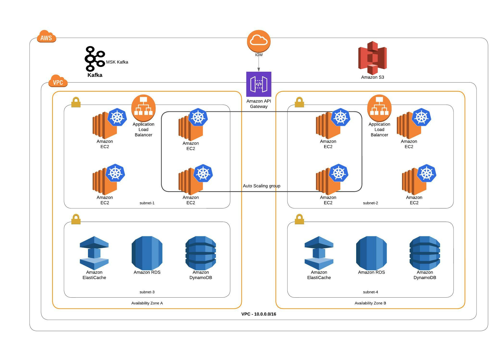

# Physical View
AWS Deployment architecture. This view shows how the services and resources can be deployed in AWS infrastructure. 

## Element Catalog 
Multiple availability zones
API Gateway
Load Balancers
AWS MSK fully managed Kafka service

#### Multiple availability zones
AWS recommends that a customer should run their workloads in more than one availability zone (AZ). 
This is because in case of a failure in any one AZ, it will not bring the system down so long as the other AZ is healthy.
For the same reason, we use multi-AZ replicas for RDS, Redis and other resources.

#### API Gateway
The API Gateway is the entry point for all requests coming into the system. It provides capabilities such as caching, load balancing. 
Throttling rules, circuit breakers can be configured at the API Gateway level. 
This helps protect the services from attacks such as Denial of service attack, etc.

#### Load Balancers
Elastic Load Balancing (ELB) automatically distributes the incoming traffic across multiple targets 
and virtual appliances in one or more Availability Zones (AZs). This helps scale resources based on the incoming traffic and 
does not overload certain containers while others are idle. Use of load balances ensures efficient use of the available resources 
thereby inproving the performance and faster response times.

#### AWS MSK fully managed Kafka service
This is the Amazon managed streaming for Apache Kafka. It helps manage the entire infrastructure associated with running Kafka instance including zookeeper, etc.
Using these managed services helps reduce the effort, cost and additional overhead of maintaining the services ourselves.

 
## Related ADRs 
- [ADR: AWS for deployment](../adrs/AWS_for_deployment.md)
