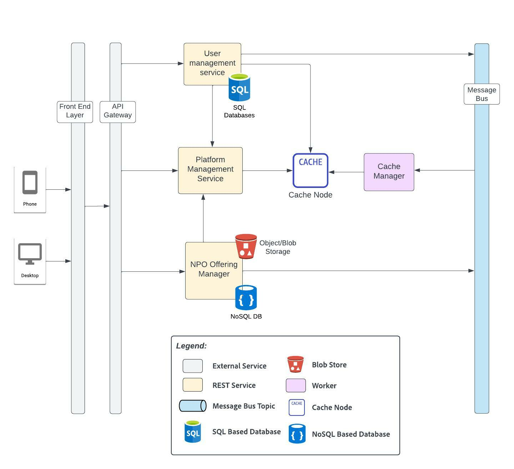
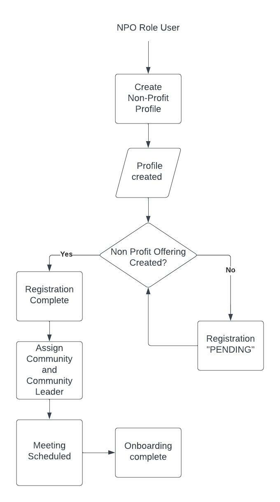
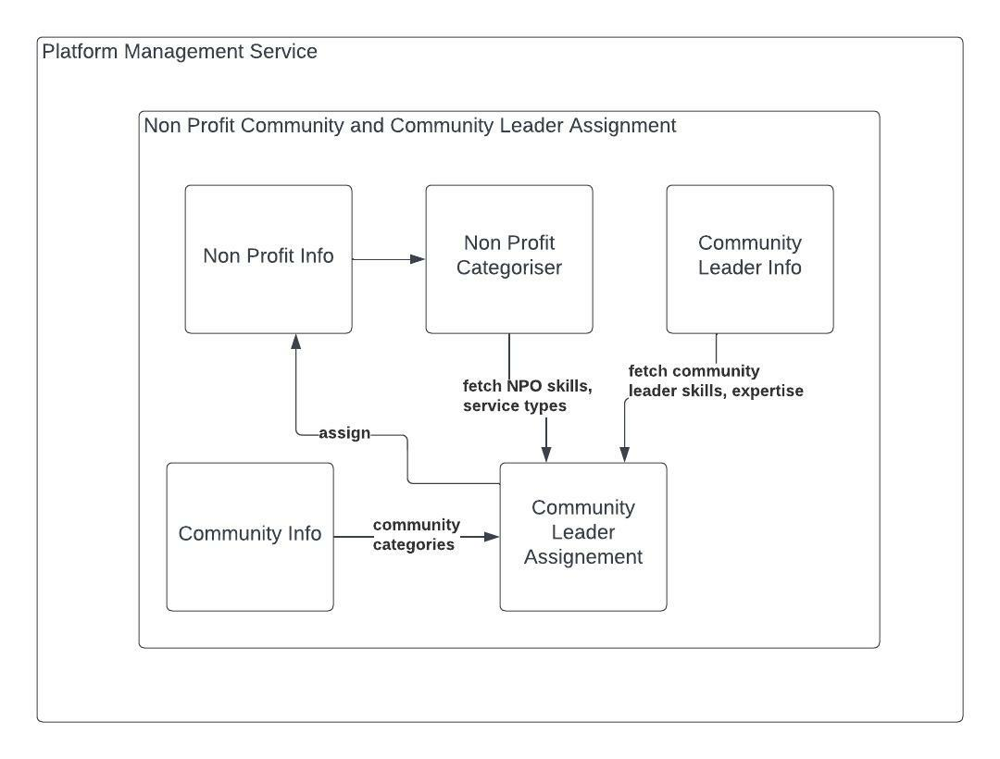
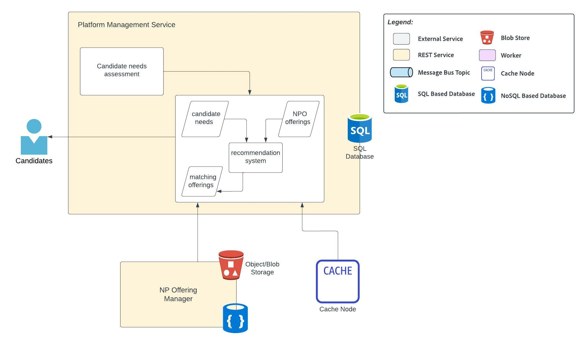
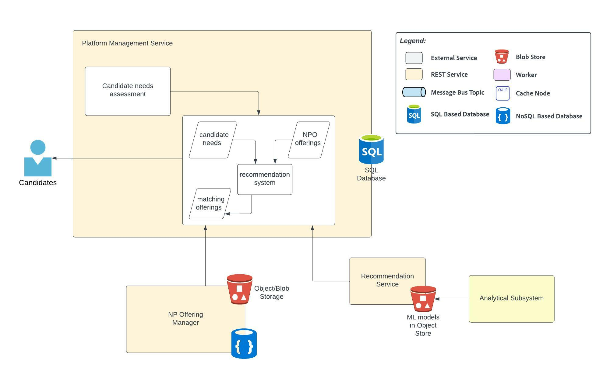

# Platform Management Subsystem
This subsystem is responsible for managing the following domains:
- User Management
- Onboarding of Non-Profit Organizations and Candidates
- Candidate Career Tracking

_Created using Lucidchart. Refer [here](https://lucid.app/documents/view/cc0f6e76-a2f8-4b24-ae71-d491d22dbe3f)._

See platform requirements [#1, #2, #8](../requirements/functional-requirements.md#functional-requirements), non-profit requirement [#NP1](../requirements/functional-requirements.md#user-stories), candidate requirements [#C1, #C2, #C3, C6](../requirements/functional-requirements.md#candidate), community leader requirement [#CL1, CL#2](../requirements/functional-requirements.md#community-leader), career mentor requirements [#CM1, #CM2](../requirements/functional-requirements.md#career-mentor) and admin requirements [#A2, #A3](../requirements/functional-requirements.md#admin).

## Element Catalog 

#### User management
- All users of the platform ( non-profit , candidates, admin, community leader, career mentor ) need to create an account.
Creation of an account follows the standard OAuth process. 
The platform provides support for Open ID based authentication that allows users to create am account using their Google, Facebook or Apple account.

- Users can opt to register as a non-profit, candidate, community leader, career mentor or admin. 
Based on the type of account created, a user is assigned a ROLE, which is added as part of the authorization token used to access the platform.
This ROLE helps identify the user's access to resources, create/modify/delete assets, and so on. 
One user can have multiple roles depending on the type of user he has logged in as.

- The user management service stores all information related to the user including but not limited to:
first name, last name, date of birth, address, email id, gender, and so on.
In addition, the roles for the user is also maintained by the user management database. 

- We use an RDBMS to store all the information pertaining to the user.

- All user information is stored in cache for quick retrieval. 

### Networking Hub Functionality & Process

#### Non-Profit Organisation Onboarding

</img>

_Created using Lucidchart. Refer [here](https://lucid.app/documents/view/b65bf118-1b70-4ded-8e78-bd304450fd9b)._

- The platform manager stores all information related to the Non profit, candidates enrolled for various non profit offerings, community leader assigned to a non-profit, etc.

- Only a user with role NPO can create a non-profit organisation profile. 

- The user who creates the non-profit profile can associate other users who belong to the same non-profit, so only such users will be allowed to modify the details of the non profit organisation.

- The non-profit profile is created by providing information such as the name, description of the non-profit, location, non-profit registration id, and so on.

- Once the non-profit profile is created, the Registration status is set to PENDING until an offering is added by the NPO.

- New offerings can be created by going to the profile page. 

- Only those users who have been added by the creator of the NPO to the non-profit page and with the role of NPO can create new offerings.

#### Non-Profit offering creation
- A non profit offering is intended to help candidates belonging to the under-represented communities in achieving fulfilling careers.

- The offerings can belong to a number of categories such as (but not limited to):
  - Resume Writing Services
  - Interview Prep Free Business Attire
  - Apprenticeship Program Registration	Training Program Registration
  - College & University Registration
  - Free Grocery & Meal Services
  - Discounted Rent & Housing Services
  - Daycare/Child Care Services
  - Mentorship/Career Advocate Services

- An offering can contain links to the non-profit website where the candidate can register for programs offered by the NPO, 
or links to training material on a third party website, links to resources, downloadable texts, pdfs, that the candidate needs to complete, 
assessments, and so on. 

- Since the schema can vary from one offering to another, we use a document db to store this information. 

- All resources ( downloadables such as text files and images ) are uploaded to an object store such as S3, and the reference to the same is 
stored in the NPO's offering data in the document db. 

- Once an offering has been created, a message containing the NPO id and the offering id, is published to a topic in Kafka.

- The platform manager reads this message from the Kafka topic, adds a mapping in the database, associating the offering id to the non-profit. 

- If the "Registration status" is PENDING, it is marked as COMPLETE and a community leader is assigned to the non-profit.

#### Community and Community Leader Assignment

</img>

_Created using Lucidchart. Refer [here](https://lucid.app/documents/view/b65bf118-1b70-4ded-8e78-bd304450fd9b)._

- A community is an independent entity that a community forum and a community leader. 

- Based on the services and the area of expertise of the non profit which is assigned to a community. 
Initially, this information is manually extracted from the NPO at the time of onboarding. 
It can however, later, be automated by using auto-tagging service powered by machine learning models.

- The platform admin assigns community leaders to various communities based on their skills and areas of expertise.

- The community leader verifies the authenticity of the non profit based on the non profit registration details on a third party website that registers the non profits.
If the NPO is found to be fake, the profile is deleted by the admin. 

- Once the community that the Non-profit belongs to is identified, a leader from the list of community leaders who belong to that community is assigned to the non-profit organisation.
This assignment is in round-robin basis so as to equally distribute the number of NPOs among the available community leaders.
The platform must ensure that no community leader handles more than a certain number of non-profits. 
Sufficient number of community leaders must be ensured by the platform admin.

- Once the community leader is assigned, a welcome email introducing the community leader is sent via the notification manager as described in [Notification and Meeting Scheduler Subsystem](./notification-and-meeting-scheduler-subsystem.md).
The community leader also assigns role based training via email to the non-profit admins. 

- An introductory meeting is set up based on the availability of the non profit and the community leader which is tracked using the meeting scheduler. 
The NPO users calendars are also blocked for monthly community meetings that are conducted either online or offline by the community leaders for networking and collaboration between the non profit organisations. 

- The user can view their meeting schedule on the platform.

- A new community can be created by a community leader, or an admin based on the type of services offered by the NPOs. An NPO can be part of one or more communities.

### Career Case Management Functionality & Process 

#### Candidate Registration and Onboarding ( Needs Assessment )
- The user registers on the platform as a candidate. The role CANDIDATE is associated with the user, which is sent as part of the authorisation token that provides access to the candidates to various resources on the platform.
- The candidate creates a career profile. All achievements, badges earned on completion of courses/offerings, community engagement, career road map, are visible on the career profile of the candidate.
- the candidate is has to complete the needs assessmenet at the time of onboarding. The platform management service receives and stores the needs assessment in the database. 
- On completing the needs assessment, the onboarding of the candidate is complete.

#### Career mentor assignment
- Once the candidate profile is complete, a career mentor is assigned to the candidate from the available career mentors on the platform.
This assignment is in round-robin basis so as to equally distribute the number of candidates among the available career mentors.
The platform must ensure that no mentor handles more than a certain number of candidates. 
Sufficient number of career mentors must be ensured by the platform admin.

- Once the mentor is assigned, a welcome email introducing the career mentor is sent via the notification manager as described in [Notification and Meeting Scheduler Subsystem](./notification-and-meeting-scheduler-subsystem.md).

- An introductory meeting is set up based on the availability of the candidate and the mentor which is tracked using the meeting scheduler. 
The candidates calendars are also blocked for biweekly 1:1 meetings with the career mentor for progress tracking and mentoring based on the availability of the candidate and the mentor. 

#### Career Roadmap Creation

| Current View | Future View |
|---|---|
| </img> | </img> |

- Based on the needs assessment, a set of offerings are recommended to the candidate. A recommendation system, which can be intially created using simple tag extaction and later using ML for more refined and accurate recommendations, uses the NPO offerings available and the needs of the candidate to recommend a set of offerings.
There can be an upper limit on the number of offerings returned as part of this recommendation so as to not overwhelm the candidate. 

- In case none of the offerings recommended by the platform are to the candidates preferences or liking, they can further browse the various offerings, based on NPO names, areas of expertise, etc using the search engine as described in [Search Subsystem](./search-subsystem.md).
The candidate receives a paginated view of the offerings for ease of browsing with powerful search capabilities.

- The candidate then selects the offerings that he wants to register for. The offerings are added to the career roadmap of the candidate with PENDING_APPROVAL status.
A notification about the same is sent to the career mentor who can then APPROVE or DECLINE the offerings selected by the candidate, suggest additional offerings, etc.

- Only the APPROVED offerings are part of the career road map. 

#### Career roadmap tracking 
- Each offering in a roadmap is tracked individually by the candidate and the career mentor. Candidates can mark assignments, modules, assessments as done as and when they complete the same either on the platform or on the Non-profit site.
Career mentors can also mark the status of the various modules or progress in an offering based on conversations they have with the candidate, or based on completion status email they might receive from the non profit organisation.
All offering are either in the following states: NOT STARTED, IN PROGRESS, WITHDRAWN, COMPLETED.

- The candidate roadmap is also in the states: NOT STARTED, IN PROGRESS, COMPLETED, based on the progress of the offerings.

- The progress bar for each offering and the overall career road map is visible to the candidates and mentors on the platform in the form of percentage(%) of completion.

- The candidates may choose to withdraw from certain offerings during the course. In such cases, the offering is no longer tracked as part of the roadmap progress, but the status is marked as WITHDRAWN.

- The platform sends push notification to the user on the app and browser and to the career mentor with the list of offerings that are in progress or not started stage, nudging the candidates to take action. 
If there are deadlines associated with an offering that the candidate has enrolled for, regular notifications are sent to the user prompting them to take action on the same. 

- When a candidate road map is completes, a feedback form is sent to the candidate seeking information on how the program helped, if they got a job offer of their choice, and so on. 

- These reports are then used by the [Analytics Subsytem](./analytical-architecture-subsystem.md) to predict career paths for candidates based on the offerings.

#### Feedback on completion 
On completion of the career roadmap, the candidate is sent a feedback form which is used for analytical purposes.

## Specific Architectural Elements

#### Content Delivery Network

#### Caching using Cache Manager

#### Object store

1. User management information
2. Non profit offerings

## Related ADRs 
- [Microservices Architecture](../adrs/adr01-microservice-architecture.md)
- [SQL v/s NoSQL](../adrs/adr03-sql-vs-nosql.md)
- [Caching using Cache Manager](../adrs/adr06-caching.md)
