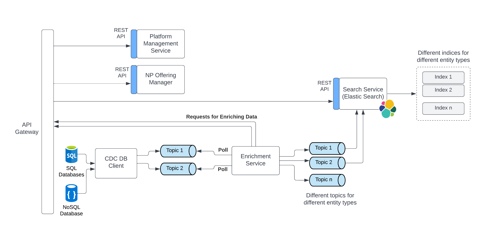

# Search and Enrichment Microservice
Search service is responsible for faster discovery and retrieval of most entities in the system. The candidates may search using the below criteria (not limited to the below list):
- Non-profit names, locations
- Interesting and relevant offerings provided by any non-profit
- Communities
- Location
- Random text for seeking any help (community forums)

</img>

## Element Catalog 

#### Enrichment Service
- Responsible for enriching all the low level data to fully qualified objects (with appropriate tags) that the search service can consume.
- Calls relevant microservice REST APIs to enrich the low-level data.
- As enriching data requires calling several APIs, poll based mechanism is preferred over push for reading data from the queue (where all database changes are published). This shall ensure that the component can process messages at its own pace.
- Responsible for tagging entities intelligently with attributes that will help discovery.
- Writes different entities to different topics so that the search service can process accordingly.

#### Search Service
- Responsible for faster discovery and retrieval of most entities in the system. This shall be powered by ElasticSearch.
- Provides a REST API that the client can leverage to get relevant results
- Consumes messages (representing tagged entities) from a queue that are published by enrichment service.
- The ElasticSearch indices are built based on the entity types.
- When a user searches for something (powered by the REST API), the search service will accumulate results from the different indices and provide relevant results.
- Since only fully qualified objects are returned, the front-end client can directly use them without any further callbacks required to individual microservices.
