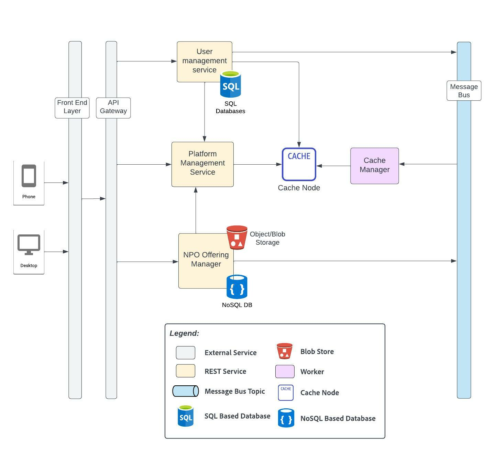

# User Management, Non-profit and Candidate Onboarding and Career Tracking

## Element Catalog 

#### User management
- All users of the platform ( non-profit , candidates, admin, community leader, career mentor ) need to create an account.
Creation of an account follows the standard OAuth process. 
The platform provides support for Open ID based authentication that allows users to create am account using their Google, Facebook or Apple account.

- Users can opt to register as a non-profit, candidate, community leader, career mentor or admin. 
Based on the type of account created, a user is assigned a ROLE, which is added as part of the authorization token used to access the platform.
This ROLE helps identify the user's access to resources, create/modify/delete assets, and so on. 
One user can have multiple roles depending on the type of user he has logged in as.

- The user management service stores all information related to the user including but not limited to:
first name, last name, date of birth, address, email id, gender, and so on.
In addition, the roles for the user is also maintained by the user management database. 

- We use an RDBMS to store all the information pertaining to the user.

- All user information is stored in cache for quick retrieval. 

### Networking Hub Functionality & Process

#### Non-Profit Organisation Onboarding

The platform manager stores all information related to the Non profit, candidates enrolled for various non profit offerings, community leader assigned to a non-profit, etc.

Only a user with role NPO can create a non-profit organisation profile. 

The user who creates the non-profit profile can associate other users who belong to the same non-profit, so only such users will be allowed to modify the details of the non profit organisation.

The non-profit profile is created by providing information such as the name, description of the non-profit, location, non-profit registration id, and so on.

Once the non-profit profile is created, the Registration status is set to pending until an offering is added by the NPO.

New offerings can be created by going to the profile page. 

Only those users who have been added by the creator of the NPO to the non-profit page and with the role of NPO can create new offerings.

#### Non-Profit offering creation
- A non profit offering is intended to help candidates belonging to the under-represented communities in achieving fulfilling careers.

- The offerings can belong to a number of categories such as (but not limited to):  
Resume Writing Services  
Interview Prep	Free Business Attire  
Apprenticeship Program Registration	Training Program Registration  
College & University Registration  
Free Grocery & Meal Services  
Discounted Rent & Housing Services  
Daycare/Child Care Services  
Mentorship/Career Advocate Services 

- An offering can contain links to the non-profit website where the candidate can register for programs offered by the NPO, 
or links to training material on a third party website, links to resources, downloadable texts, pdfs, that the candidate needs to complete, 
assessments, and so on. 

- Since the schema can vary from one offering to another, we use a document db to store this information. 

- All resources ( downloadables such as text files and images ) are uploaded to an object store such as S3, and the reference to the same is 
stored in the NPO's offering data in the document db. 

- Once an offering has been created, a message containing the NPO id and the offering id, is published to a topic in Kafka.

- The platform manager reads this message from the Kafka topic, adds a mapping in the database, associating the offering id to the non-profit. 

- If the "Registration status" is PENDING, it is marked as COMPLETE and a community leader is assigned to the non-profit.

#### Community and Community Leader Assignment

- Based on the services and the area of expertise of the non profit which is assigned to a community. 
Initially, this information is manually extracted from the NPO at the time of onboarding. 
It can however, later, be automated by using auto-tagging service powered by machine learning models.

- The platform admin assigns community leaders to various communities based on their skills and areas of expertise.

- Once the community that the Non-profit belongs to is identified, a leader from the list of community leaders who belong to that community is assigned to the non-profit organisation.
This assignment is in round-robin basis so as to equally distribute the number of NPOs among the available community leaders.
The platform must ensure that no community leader handles more than a certain number of non-profits. 
Sufficient number of community leaders must be ensured by the platform admin.

- Once the community leader is assigned, a welcome email introducing the community leader is sent via the notification manager as described in [Notification and Meeting Scheduler Service](./notification-and-meeting-service.md).
The community leader also assigns role based training via email to the non-profit admins. 

- An introductory meeting is set up based on the availability of the non profit and the community leader which is tracked using the meeting scheduler. 
The NPO users calendars are also blocked for monthly community meetings that are conducted either online or offline by the community leaders for networking and collaboration between the non profit organisations. 

- The user can view their meeting schedule on the platform.

### Career Case Management Functionality & Process 

#### Candidate Onboarding 
#### Career mentor assignment
#### Career roadmap creation
#### Career roadmap tracking 
#### Feedback on completion 

 
## Related ADRs 
- [SQL v/s NoSQL](../adrs/adr03-sql-vs-nosql.md)

